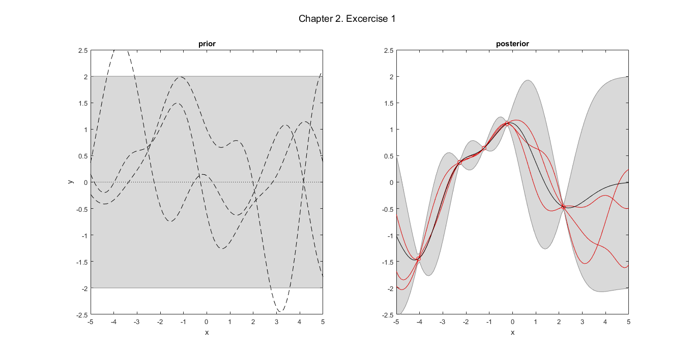
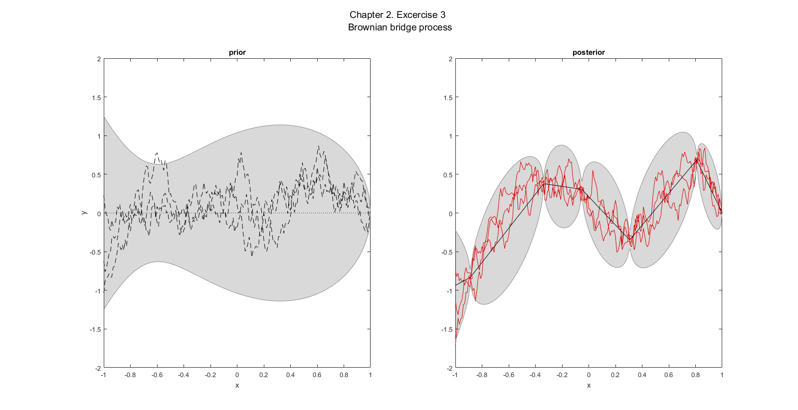

# Gaussian Processes for Machine Learning
Chapter 2

Excercise 1
[matlab code](q01.m)

Excercise 2

Excercise 3

<!--- \begin{bmatrix}X\\Y \end{bmatrix}  \sim N \big( \begin{bmatrix} \mu_x \\ \mu_y \end{bmatrix}, \begin{bmatrix}A & C^T \\C & B \end{bmatrix}  \big) \\
X | y \sim N \big(\mu_x+C^TB^{-1}(y-\mu_y),A-C^TB^{-1}C\big)\\
f_* | x_*, x=1, y=0 \sim N\big(0,K(x_*,x_*)-K(x_*,x)K(x,x)^{-1}K(x,x_*)\big) \\
\Rightarrow BBP \sim N\big(0,min(x,x_*)-xx_*\big)--->

Sampling from this process:

