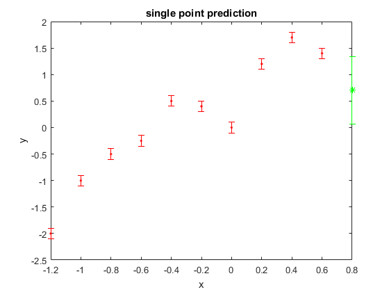
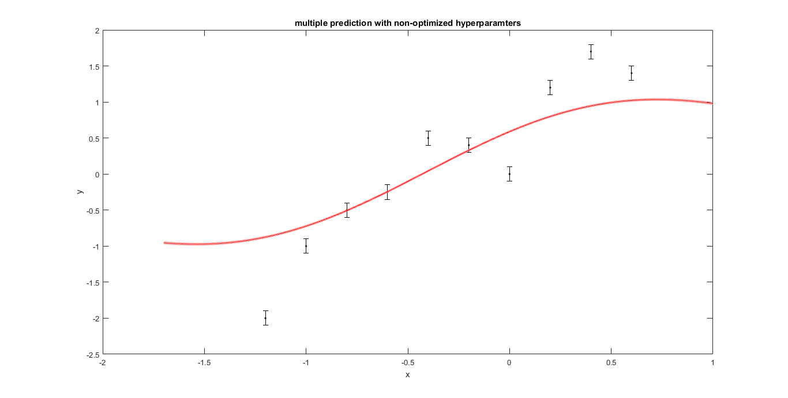
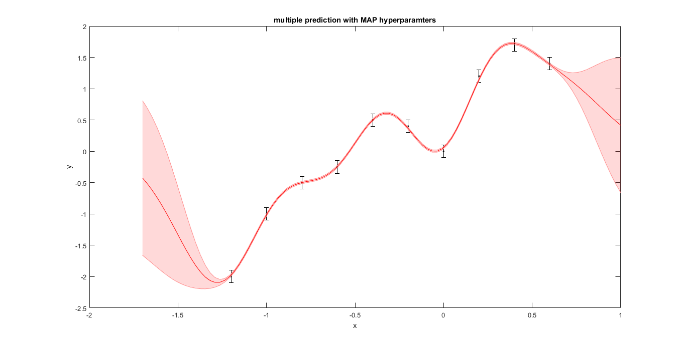

# Regression using Gassuain Processes

[Try in **Python**](GRP.ipynb)
[or in matlab](GPR.mlx)

we have noisy sensor readings (indicated by errorbars).
first we will do a point prediction:

Next we will predict 100 points

And we finally use MAP estimate of the hyperparameters:

